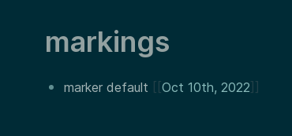

## Logseq Marks plugin

Manage marks (pointers) to track references to pages, from the page you want to be marked (pointed to).

E.g. if you do a periodic cleanup of your journals, for example a review which you may not always do exactly every week.
You may not remember exactly which was the last page that you finished.
This plugin lets you keep track of the last journal page that has been processed. When you're finished with your last journal page, just run "/mark"
to update the pointer to the current page.  Next time you can just check the mark and resume starting with the next page.

## How to use

* In Plugin settings, configure which page you want to use to manage the marks (default: "marks")
* Use `/mark` to update the mark to point to your current page.
* Go to the marks page to see where your mark(s) point to.

## Limitations

* At this time there is only one mark, named default. In the future it will probably support multiple marks.
* only marks pages, not blocks.

### Running the code

- `npm install && npm run build` in terminal to install dependencies
